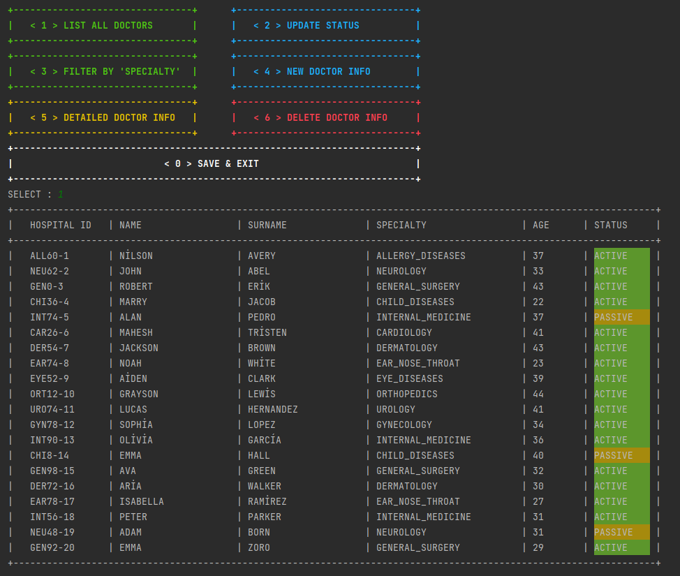

# PatientServiceManagement

Training Project II

This project is a training project on patient service management. 

In this project, it is aimed to create a program that can run locally by using files as DB.

## Screenshots

### Sections

  

This is a screenshot of all sections.

### List All Doctors

  

This is a screenshot of "List All Doctors"

### Doctor Information

  

This is a screenshot of "Detailed Doctors Info"

### Medical History

  

This is a screenshot of the patient "Medical History"

### New Appointment

  

This is a screenshot of a sample of "New Appointment"

### Check Appointments

  

This is a screenshot of 'Check Appointments' and the way appointments are sorted.
